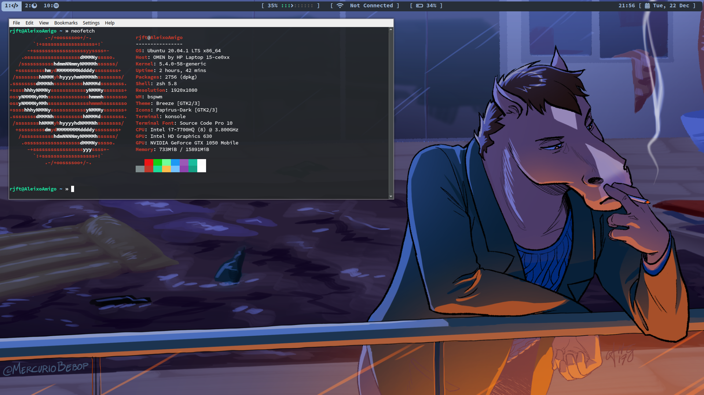
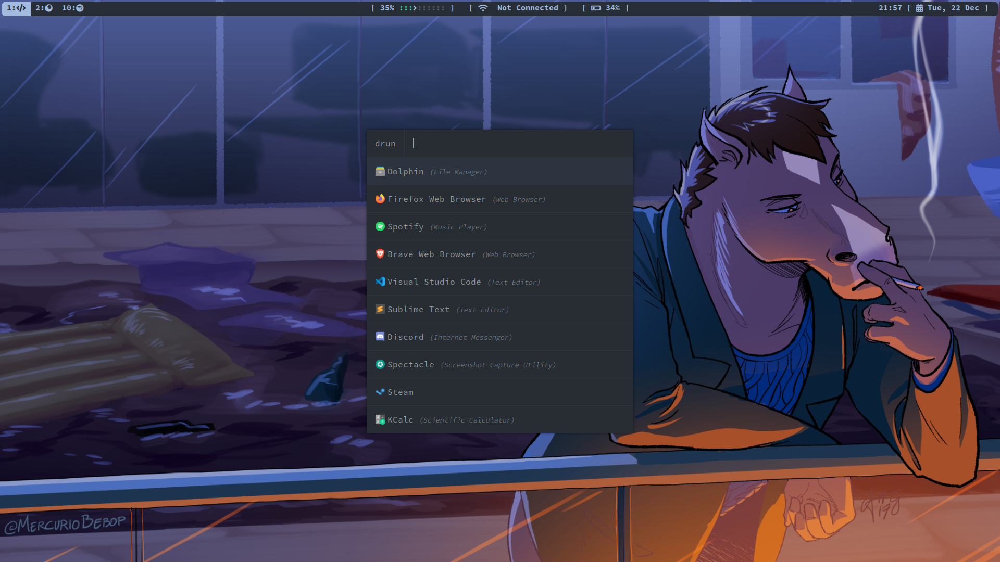

# My dot files
Last tested on Kubuntu 20.04

## Installing _bspwm_
_sudo apt install bspwm_
_sudo apt install playerctl_ for media player
_sudo apt install xbacklight_ for light

## Install FontAwesome font
Download the font-files from _https://fontawesome.com/how-to-use/on-the-desktop/setup/getting-started_
##### usefull cheatsheet
_https://fontawesome.com/cheatsheet_

## Installing _polybar_
1. _sudo apt-get install cmake cmake-data libcairo2-dev libxcb1-dev libxcb-ewmh-dev libxcb-icccm4-dev libxcb-image0-dev libxcb-randr0-dev libxcb-util0-dev libxcb-xkb-dev pkg-config python3-xcbgen xcb-proto libxcb-xrm-dev libasound2-dev libmpdclient-dev libiw-dev libcurl4-openssl-dev libpulse-dev libxcb-composite0-dev xcb libxcb-ewmh2 python3-sphinx libjsoncpp-dev _	
2. _git clone https://github.com/jaagr/polybar.git_ 	
3. _cd polybar && ./build.sh_ 	
4. Copy config file from this repo to **_.config/polybar/_**

## Installing _picom_ (compositor)
1. _sudo apt install libxext-dev libxcb1-dev libxcb-damage0-dev libxcb-xfixes0-dev libxcb-shape0-dev libxcb-render-util0-dev libxcb-render0-dev libxcb-randr0-dev libxcb-composite0-dev libxcb-image0-dev libxcb-present-dev libxcb-xinerama0-dev libxcb-glx0-dev libpixman-1-dev libdbus-1-dev libconfig-dev libgl1-mesa-dev libpcre2-dev libevdev-dev uthash-dev libev-dev libx11-xcb-dev meson_
2. _git clone https://github.com/yshui/picom && cd picom_
3. _git submodule update --init --recursive_
4. _meson --buildtype=release . build_
5. _ninja -C build_
6. _sudo ninja -C build install_
7. Copy **picom.conf** from this repo to **_.config/picom/_**

## Installing _rofi_
1. _sudo apt install rofi_
2. Copy the files from repo to _.config/rofi/config_
3. Copy the config to the directory in config file

### Source:
1. https://github.com/davatorium/rofi-themes/blob/master/User%20Themes/slate.rasi
